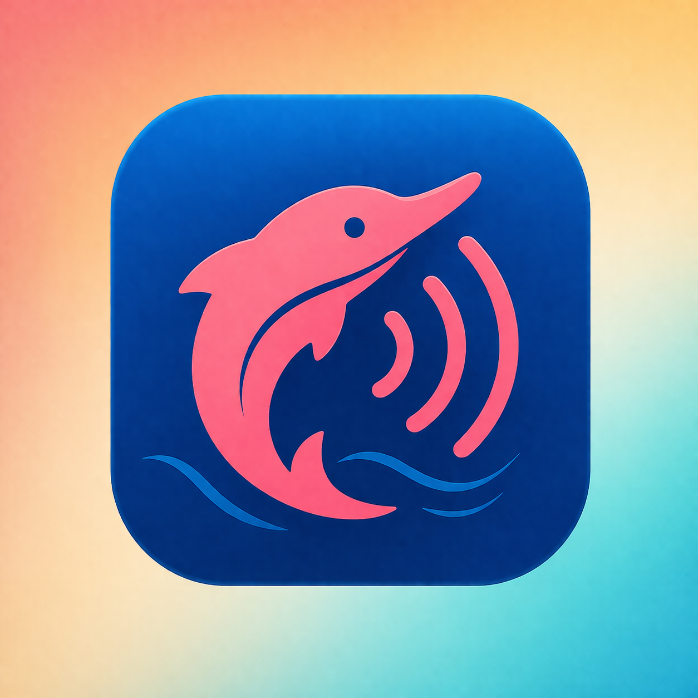

# BotoChat

  

O **BotoChat** é uma aplicação mobile de mensagens descentralizada desenvolvida em **React Native**, que dispensa o uso de internet ao utilizar protocolos de proximidade, como o **Bluetooth**, para estabelecer conexões *peer-to-peer*. Inspirado na fauna brasileira e no conceito de **ecolocalização**, o projeto foca em uma arquitetura *local-first*, onde a identidade visual remete ao boto-cor-de-rosa e a comunicação ocorre de forma direta entre dispositivos próximos, sendo ideal para contextos de privacidade ou ausência de rede. Nosso aplicação é multi-protocolo.

**Comunicação offline e descentralizada**. Utilizar protocolos como Bluetooth e Wi-Fi Direct (P2P) cria uma rede "mesh" onde a dependência de servidores centrais diminui, o que é excelente para privacidade e para locais sem sinal.

## Project Dependencies & Maintenance

This section tracks third-party dependencies required for specific features. If a feature is removed, follow the instructions below to uninstall.

| Package | Purpose | Uninstallation Command |
| :--- | :--- | :--- |
| `expo-sqlite` | Local message persistence | `npx expo uninstall expo-sqlite` |
