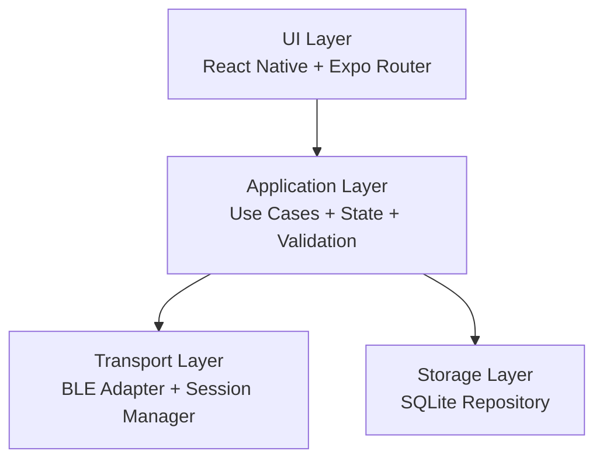

# Boto Chat — Arquitetura Inicial (MVP)

**Data:** 9 de abril de 2026

## Visão de camadas

## 1) UI Layer
**Responsabilidade:** experiência do usuário, navegação e apresentação de estados.

Componentes principais:
- Tela de descoberta de dispositivos.
- Tela de conversa 1:1.
- Indicadores de conexão e alcance.
- Estados de erro/permissão.

## 2) Application Layer
**Responsabilidade:** regras de negócio e orquestração.

Serviços/casos de uso previstos:
- `scanNearbyDevices()`
- `connectToPeer(peerId)`
- `sendMessage(conversationId, text)`
- `observeIncomingMessages()`
- `persistMessage(message)`
- `getConversationHistory(conversationId)`

Entidades iniciais:
- `Peer`
- `Conversation`
- `Message`
- `ConnectionState`

## 3) Transport Layer
**Responsabilidade:** abstrair protocolo de proximidade e sessão de conexão.

Decisão MVP:
- Protocolo primário: **BLE**.
- Biblioteca candidata principal: `react-native-ble-manager`.
- Alternativa a validar no spike técnico: `react-native-multipeer-connectivity` (foco iOS/multi-peer).

Módulos:
- `BleAdapter`: scan, connect, disconnect, read/write.
- `SessionManager`: keep-alive, detecção de perda de alcance, retries simples.
- `PermissionsGateway`: permissões por plataforma.

## 4) Storage Layer
**Responsabilidade:** persistência local e consulta de histórico.

Decisão MVP:
- Banco local: **SQLite**.
- Wrapper simples para isolamento de queries e futura troca de engine.

Tabelas iniciais:
- `peers(id, display_name, last_seen_at)`
- `conversations(id, peer_id, created_at, updated_at)`
- `messages(id, conversation_id, sender_peer_id, body, status, created_at)`

## Fluxos principais
1. **Descoberta:** UI solicita scan → Application orquestra → Transport retorna peers.
2. **Conexão:** UI seleciona peer → Application valida estado → Transport conecta.
3. **Mensagem:** UI envia texto → Application cria `Message` → Transport transmite → Storage persiste status.
4. **Recebimento:** Transport detecta payload → Application valida/normaliza → Storage salva → UI atualiza.

## Requisitos não-funcionais (MVP)
- Modularidade para evoluir BLE para multi-protocolo (Wi-Fi Direct em v2).
- Observabilidade básica via logs de sessão e eventos críticos.
- Tolerância a falhas com reconexão limitada e mensagens de erro amigáveis.

## Decisões em aberto (spike da Semana 1)
- Bibliotecas definitivas por plataforma (BLE e permissões).
- Estratégia de framing de payload (tamanho máximo e chunking).
- Política de retries e timeout de sessão.
